# Computer Organization and Design

# Basics
## ISA
ISA is selected for performance and cost, so we need simplicity and regularity.

More powerful instruction doesn't guarantee faster execution. 

Example: x86 REP MOVSB vs RISC-V LOAD + STORE. x86 MAC vs saperate RISC-V instructions that can fill up the pipe.

__Turing Complete__: Need only logical functions, read and write memory, and data-
dependent decisions

## Addressing Mode
1. Register Addressing
2. Base Addressing (Displacement)
3. Immediate Addressing
4. PC Relative Addressing

... many more are not included in the RISC-V, but good to know (Pseudodirect, Autoupdate).

### Manipulation of Accumulate and Stack Machine

## Critical Path
The critical path will be __load__ instruction, check timing below:

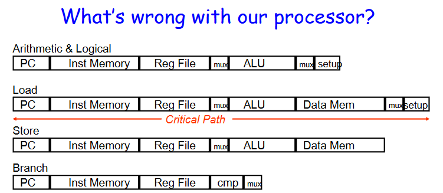

The idea is __ALL__ the instructions will take the same time as the __slowest__ instruction.

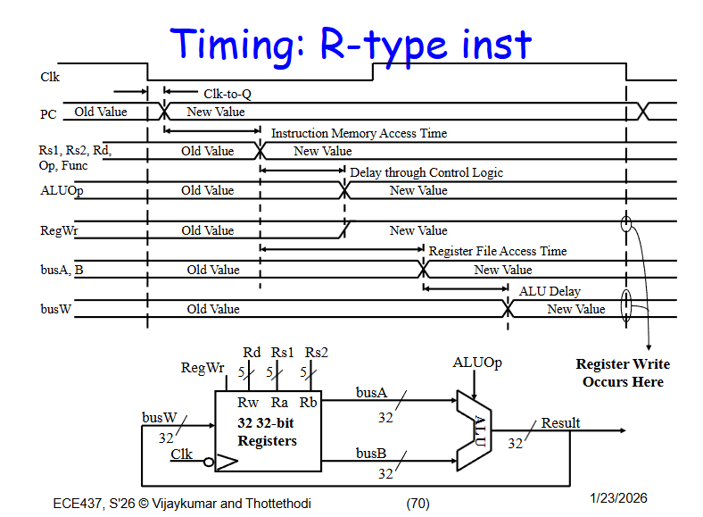
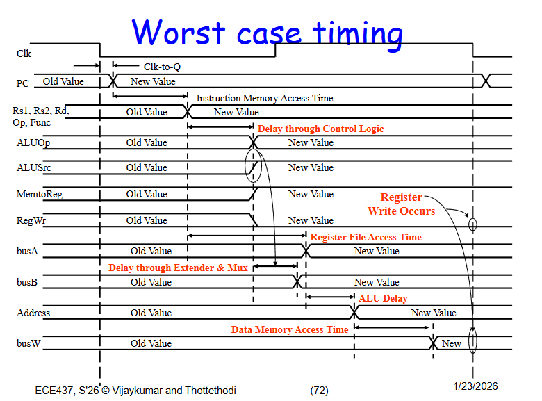

# Performance
## What
`Performance = 1 / Time` 

`Speedup = time_old / time_new`, Time is typically CPU runtime or response time.

MachineA is n times faster than MachineB: `performanceA = performanceB * n` or `timeB = timeA * n`.

### Iron Law (reliable)

`Time/Program = instr/program * cycle/instr * time/cycle = instr executed * instr per cycle (CPI) * clock time`

We need overall decrease for the product, instead of individual term, which may cause increase of other terms. 

### MIPS (bad)

Millions instructions per second: `MIPS = instruction_count / (time * 10^6)`, which is basically inverse of `cpi * clock_time`, which ignores the factor of compiler can have on `instr/program`.

Counter Example: dedicated division module can finish division in single 2-cycle instruction __vs__ 50 saperate instructions to finish a division. The better one increase the CPI, but the worse one is better, according to the MIPS. 

### MFLOPS (bad)

Millions FP Operations per second: `FP ops in program / (time x 10^6)`. 

Also ignore the effect of compiler. e.g. converting a division to mult, because mult is cheaper. Unfair because we can convert a division into many mult operations, while other benchmark may use a division hardware that can do it even faster, but many mult operations increase FP ops in the program, which increase the MFLOPS score.

## How

People use __System Performance Evaluation Cooperative (SPEC)__, like SPEC2006, SPEC89 as benchmark.

We normalize the runtime against Gold Standard Processor (SPEC ratio). After multiple run case, we will need a parameter to say, WHICH ONE IS BETTER?

### Arithmetic Average (AM)

`AM = (t1 + t2 + ... + tn) / n`, when the programs are equally important. If the programs are not run equally often, we use __Weighted AM__.

Used with __RAW Times__ to compare two machines. 

### Harmonic Mean (HM)

`HM = n / (1/rate_1 + 1/rate_2 + ... + 1/rate_n)`, When equally important. The weighted version is `HM = n / (w1/rate_1 + w2/rate_2 + ... + wn/rate_n)`.

Used when only __Rate__ is provided, like MIPS.

### Geometric Mean (GM) (SPEC used to normalize against their Golden Model)

GM is mathematically convenient, regardless of what machine it is normalized to (ratio here), we can have the same result, but sometimes cannot reflect real runtime condition. For example here, Even we use the weighted GM, it cannot reflect the real runtime.

`GM = (ratio_1 × ratio_2 × ... × ratio_n)^(1/n)`, when __Ratio__ is provided.

## Improvement

### Amdahl's Law

`speedup = time_old / time_new = (unaffected_old + affected_new) / (unaffected_new + affected_new) = ((1-f)*T + f*T) / ((1-f)*T + f*T/s) = 1 / ((1-f) + f/s)`

T = time_old ; f = affected fraction ; s = speedup.

This law tells us that a little speedup tp the common case is more meaningful than huge speedup to the rare case.

## Pipelining

### Why

In order to increase the performance, according to the Iron Law, we need to either decrease CPI or clock time. 

We __Break__ instructions into 5 cycles, and __Overlap__ them. By doing this, we can __increase the clock__ frequency by a factor of n, because the critical path is cut into n pieces. 

However, the __Latency__ will __not change__, or even slower, because of latch overhead about 1-2%.

Remember the idea. The clock frequency will be limited by the __slowest__ stage.

With pipelining, the __Effective CPI__ will always be 1. It takes time to fill up the pipe, but with millions of instructions, the filling/draining is ignored.

The actual speedup is calculated as: `speedup = (n*1*t) / (n*1*t/P + (P-1)*t/P) = P/(1 + (P-1)/n)`, where n = total_instr ; t = cycle_time ; P = pipeline_stage.

### 5 Stages of Instruction
1. Instruction Fetch (IF)
2. Instruction Decode (ID)
3. Execute (Exe)
4. Memory (Mem)
5. Write Back (WB)

Datapath:
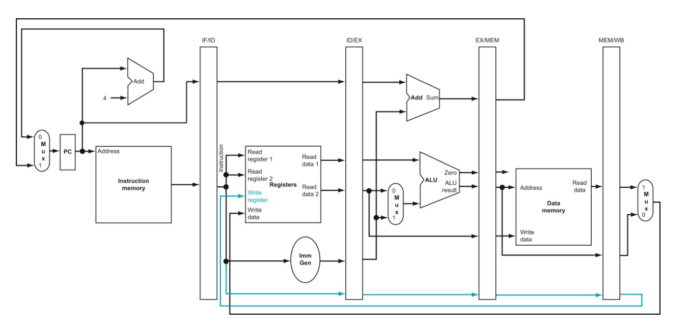

# Pipeline Problems & Solutions
We need to pretend everything works sequentially, but actually overlapping. ____Dependency____ is the key.

## Control Signals

The control signals should also go through the pipeline. We will have control unit located at ID phase. We will __generate__ the control signals, and __consume__ it gradually. 

For example, signals should change according to the design.

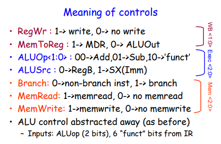

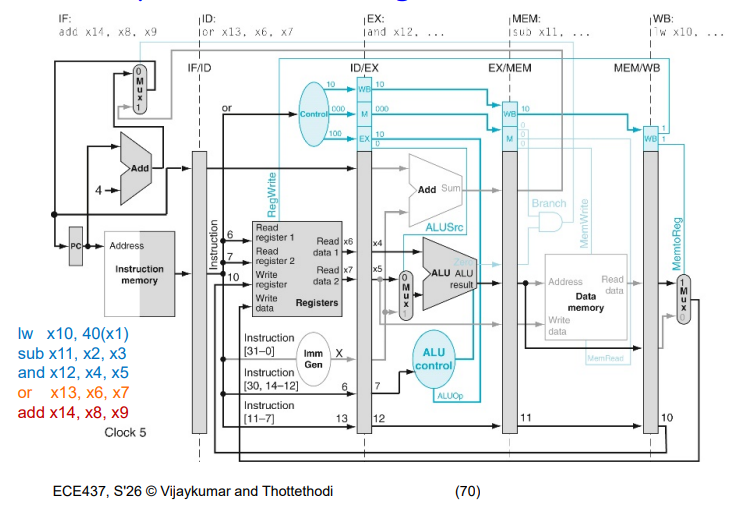

- The arbiter should receive requests from IF and Mem stage.


## Structural Hazard
Two instructions need the same hardware at the same time.

## Problem - Different Stage Count

__Load__ uses 5 stages, and __R type__ uses 4 stages. So, WB stage will happen Structural Hazard.

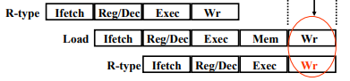

### Soution

We can make a NOP stage, and the same thing apply to __B type__ and __S type__. If we make all of them 5 stages, everything will be fine.

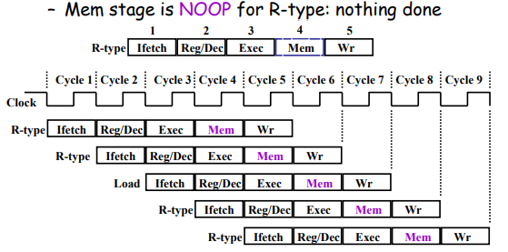


## Data Hazard
Data is not ready. Dependency Problems.

#### Read After Write (RAW)

We need to read from a register, but previous instruction has not written back yet. Therefore, we read the wrong value.

#### Write After Write (WAW)

The previous instruction's write overwrite the data we want to write in current instruction.

#### Write After Read (WAR)

Opposite of RAW, where current instruction overwrite the data read by the previous instruction. Therefore, the previous instruction read wrong value.

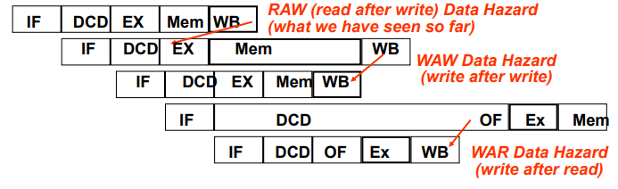

## Problem - RAW (R-type)

RAW hazard is the only hazard type will occur in RISC-V. As shown above, we need travel back in time to get desired data. 

### Solution

We need to know which stage will data we need first being calculated and stored. __Forwarding__ is the solution.

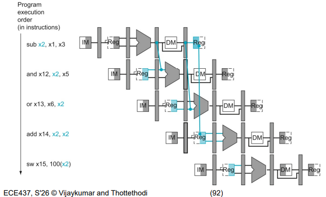

Through observation, the data will be available at __EXE/MEM__ latch. Therefore, we can forward from there to the input of ALU.

__Actually__ we only need two forwarding, because the third one can read the written data from the register file without problem.

### How

Additional Logic of a __Forwarding Unit__ needs to be added. We need to consider __Two__ cases of forwarding, as shown in the image.

The forwarding values __MUST__ come from latches. Timing not met.

We need to compare if the destination register of previous instruction same as the source register of current instrucion.
```
EX/MEM.RegisterRd == ID/EX.RegisterRs1
EX/MEM.RegisterRd == ID/EX.RegisterRs2
MEM/WB.RegisterRd == ID/EX.RegisterRs1
MEM/WB.RegisterRd == ID/EX.RegisterRs2

Sametime, we need to fulfill

(MEM/WB.RegWrite AND MEM/WB.RegsterRd != 0) // r-type and rd is used
```
If both condition matched, we need to forward the latest one, __EX/MEM__.

Example RTL, with control signals:
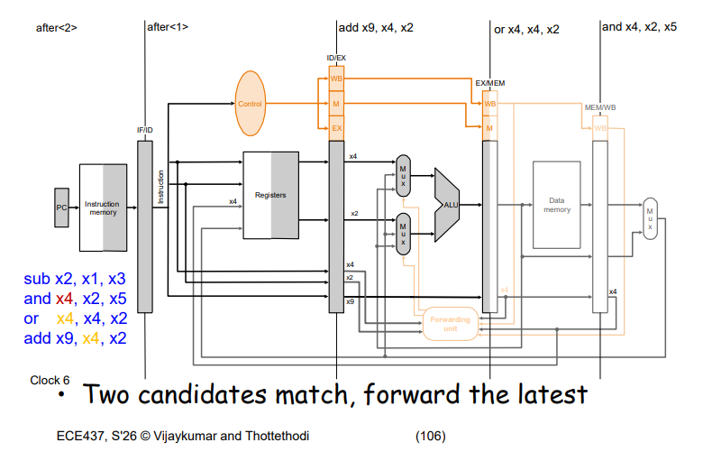

## Problem - RAW (LW-type)

With __LW__, the forwarding method will not work, because the earliest data available is at __MEM/WB__, when the next operation already processed with ALU.

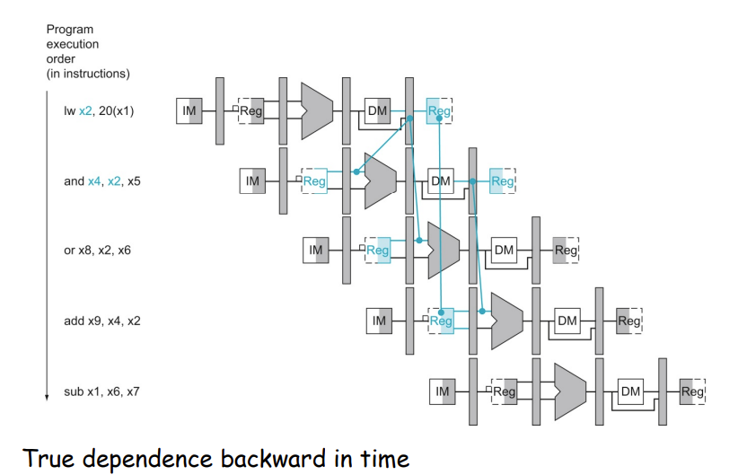

### Solution

The only method we can use is to __Stall__, because of timing.

### How

We detect the hazard at __EXE__ stage, so the next instruction will not execute with wrong data. Since we need to __Inject__ NOP, we need to have control unit before the EXE stage, which is ID stage. 

The __IF/ID__ latch should remain as it is, and __PC__ will stay unchanged. 

We detect when we will need memory access, and the following instructions will use the rd.
```
 If(ID/EX.MemRead AND (ID/EX.RegRd = IF/ID.RegRs2 OR ID/EX.RegRd = IF/ID.RegRs1))
```
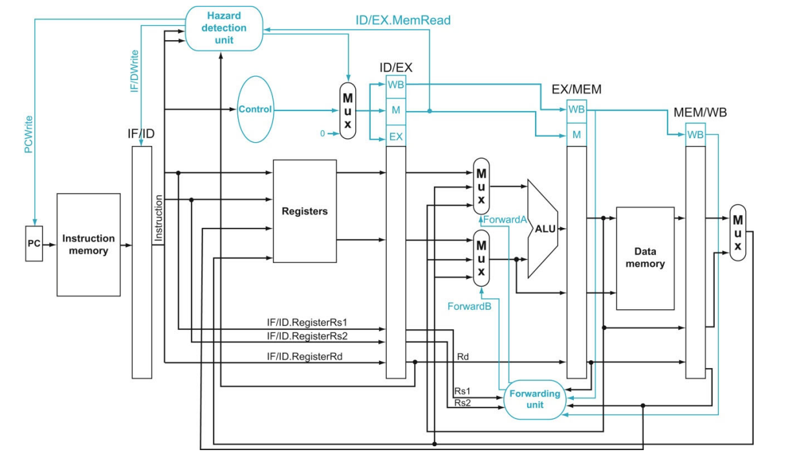

### Solution - compiler

We can use the compiler inject NOP for us after each LW. We can bring unrelated (not depend on LW) to fill the NOP gap, which optimize the CPI.


# Control Flow Hazard

Attempt to make a decision before the condition is evaluated.

## Problem - Branch Decision and Timing

The earliest time we will have branch target available for a __B-type/jal/jalr__ (any instruction that needs to interact with PC) is at the EXE stage. Therefore, we need to read from the EXE/MEM latch.

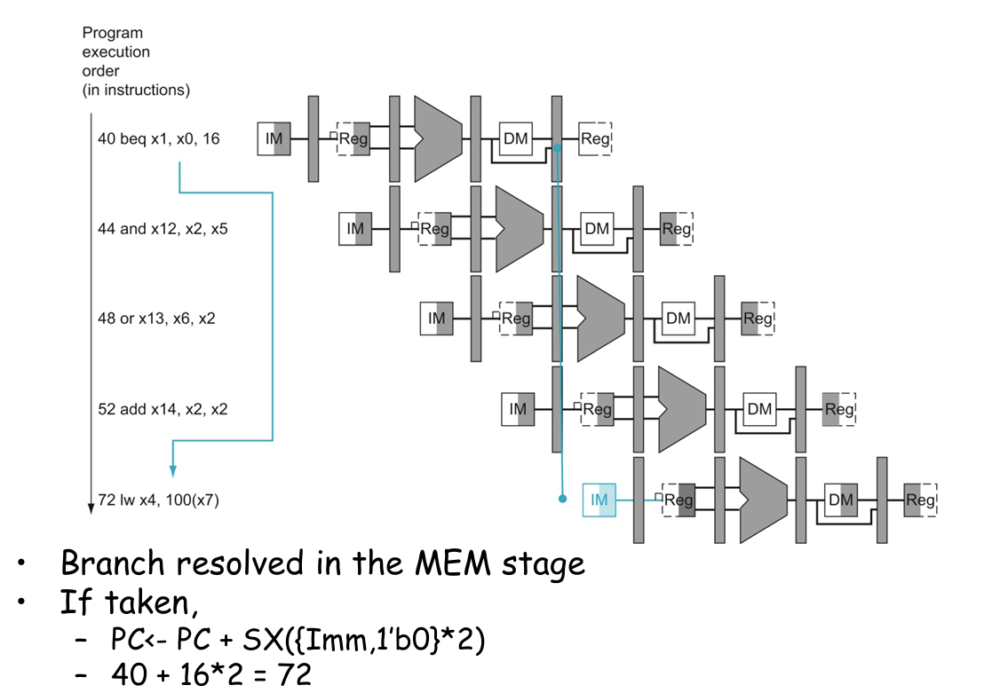

If we try to solve this problem by stalling, we need to add three bubbles, to account for extra three instructions. As the pipeline stages increase, the number of bubbles will increase, because we need to make data available from the EXE stage to IF stage. A huge jump.

### Solution 2 - Branch Logic Early (not good)

We can bring the branch logic into the __ID__ stage, where we calculate the rdat directly from the register file. We are able to forward the branch target to the PC combinationally from the ID, so we eliminate two bubbles.

However, when we recall the solution to __R-type RAW hazard__, where we forward the register data from __EXE/MEM__ latch to the ALU src. We cannot have the correct rdat with one bubble. We need two bubbles in case of dependency with R-type. Similar to LW, we need 2 bubbles. 

### Solution 3 - Predict + Bubble/Sol#2

We can predict that we __no take__ the branch, because there are a lot of loops in the software. 

If we predict it correctly, there will be no bubble. If we predict wrong, we need to __NOP__ the predicted notake. 

After this, we can 
- use solution 2 to forward the branch target, which may use 1/2 bubbles. 
- use solution 1, stalling, which will create 3 bubbles.

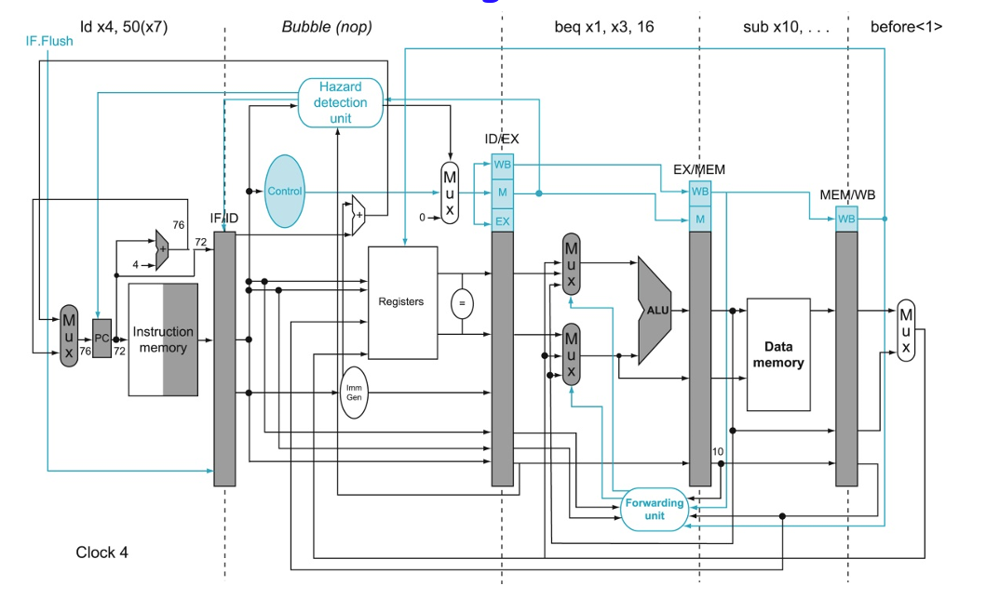

### How

#### Dynamic Predictoin

Apart from always take or always notake, we can use a FSM to keep history of predict history, and make decisions based on it.

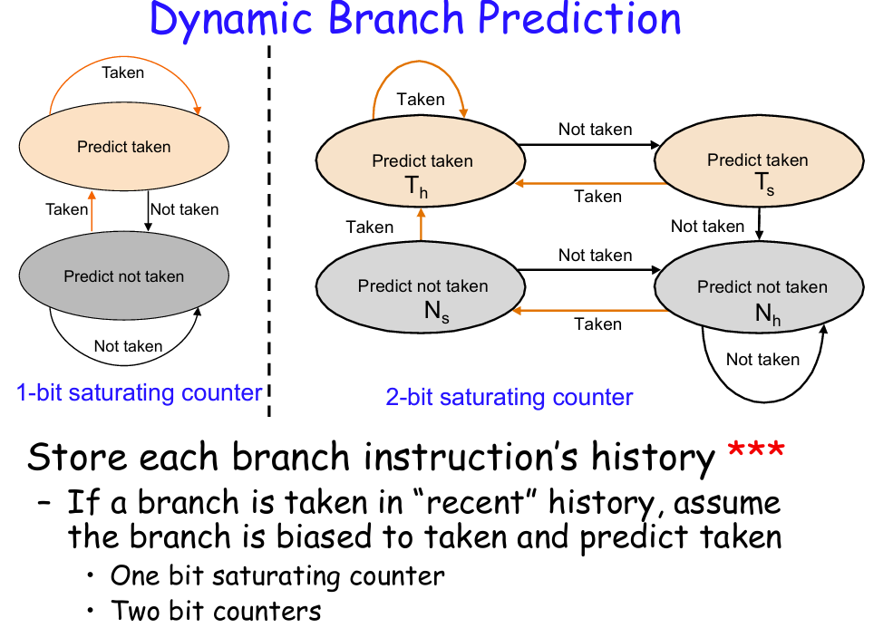

__Problem__: If we choose Taken, how does the PC know where is the taken PC address?

#### Branch Target Buffer

In order to go the target, we can use a lookup table to see where we should go. 

By having a BTB at the fetch stage, combining with the branch predictor, we are able to make the jump when Take decision is made. 

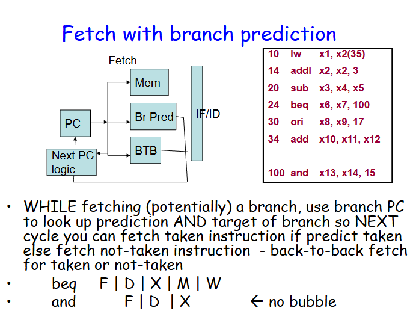

### Solution 4 + 2 - Delayed Branch

Combining with solution 2, moving the branch logic earlier, we are able to achieve no bubble by inserting instruction in one delayed block. 

We need to make sure that the instruction selected for the slot needs to be independent of Take or No Take. Independent means that the destination of the slot cannot be the source for any choice (that rd is dead). 

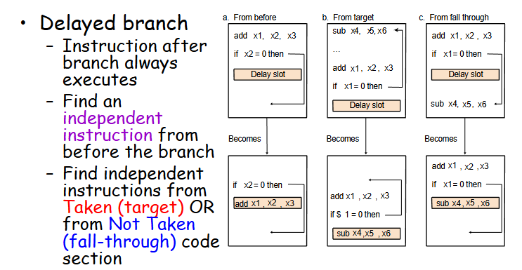


