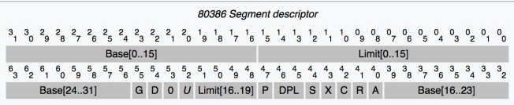
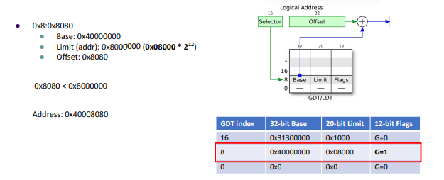
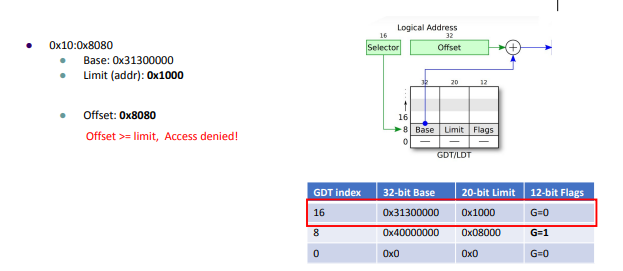
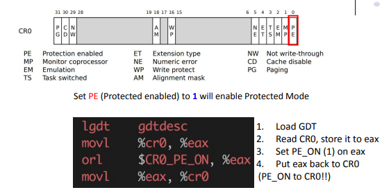
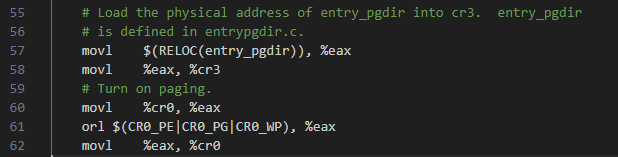

# ECE469: Operating System Engieering

This is a course focus on Operating System, Adapted from MIT6.828, using JOS as primary lab materials. Other's [note](https://knowledgehive.github.io/6.828/). [Textbook](file/OS-11.07.23.v1.10.pdf).

# Learned in Labs

## Lab1
### PC's physical address space.

    +------------------+  <- 0xFFFFFFFF (4GB)
    |      32-bit      |
    |  memory mapped   |
    |     devices      |
    |                  |
    /\/\/\/\/\/\/\/\/\/\

    /\/\/\/\/\/\/\/\/\/\
    |                  |
    |      Unused      |
    |                  |
    +------------------+  <- depends on amount of RAM
    |                  |
    |                  |
    | Extended Memory  |
    |                  |
    |                  |
    +------------------+  <- 0x00100000 (1MB)
    |     BIOS ROM     |
    +------------------+  <- 0x000F0000 (960KB)
    |  16-bit devices, |
    |  expansion ROMs  |
    +------------------+  <- 0x000C0000 (768KB)
    |   VGA Display    |
    +------------------+  <- 0x000A0000 (640KB)
    |                  |
    |    Low Memory    |
    |                  |
    +------------------+  <- 0x00000000


### BIOS
The BIOS will handle __basic IO initialization__, and pass the process to the bootloader. 

It used __16 bit real mode__, which uses physical memory directly.

#### Calculation
The format is [segment:offset]. The final address = segment * 16 + offset or segment << 4 + offset.

### Bootloader
- 32bit protected mode, able to address 4GB space.
- Use virtual memory, index using GDT (global descriptor table). Paging.

#### ELF

The ELF (Excutable and Linkable Format) is defined at `inc/elf.h`. It contains loading information. 

- ELF __Section Header__, which contains program layout, checked with `objdump -h obj/kern/kernel`. Example: `.rodata` means Read-only data; `.data`means data section holds the program’s initialized data; `.bss`means section reserved for uninitialized global variable...

```
Kernel Binary Layout:
┌─────────────────────┐
│      .text          │  (code)
├─────────────────────┤
│      .data          │  (data)
├─────────────────────┤
│      .stab          │  ← __STAB_BEGIN__ points here
│  ┌───────────────┐  │
│  │ Stab entry 0  │  │  Index 0
│  │ Stab entry 1  │  │  Index 1
│  │ Stab entry 2  │  │  Index 2
│  │     ...       │  │
│  │ Stab entry N  │  │  Index N
│  └───────────────┘  │
│                     │  ← __STAB_END__ points here
├─────────────────────┤
│     .stabstr        │  ← __STABSTR_BEGIN__ points here
│  "kern/init.c\0"    │
│  "i386_init\0"      │
│  "cons_init\0"      │
│       ...           │
│                     │  ← __STABSTR_END__ points here
└─────────────────────┘
```
- `VMA`: linked address. Execution assumes section is here
- `LMA`: load address. where section is placed when loaded
- ELF __Program Header__, which describes how loader should work for the program, check with `objdump -p obj/kern/kernel`. Example:
```
obj/kern/kernel:     file format elf32-i386

Program Header:
    LOAD off    0x00001000 vaddr 0xf0100000 paddr 0x00100000 align 2**12
         filesz 0x00007f46 memsz 0x00007f46 flags r-x
    LOAD off    0x00009000 vaddr 0xf0108000 paddr 0x00108000 align 2**12
         filesz 0x0000b6e1 memsz 0x0000b6e1 flags rw-
   STACK off    0x00000000 vaddr 0x00000000 paddr 0x00000000 align 2**4
         filesz 0x00000000 memsz 0x00000000 flags rwx
```


### Kernel
The bootloader will handle the process to the kernel.

#### Stack

The `stack` is initialized in `kern/entry.S`, as well as `ebp` and `eip`. The position is defined by `bootstack` and `bootstacktop` as descriped in `obj/kern/kernel.sym`.

- `kern/entrypgdir.c` map virtual memory in the kernel, once paging enabled in `kern/entry.S`
- `ebp`: a register stores info about base pointer, the position when function enters/
- `eip`: a register stores info about instruction pointer, return address of a function call
- `esp`: a register stores info about stack pointer moving along with function instructions.


#### STAB
 __Stab__ is a format to descript a program to a debugger. 

 After running `objdump -h obj/boot/boot.out`, we see:
 ```
 2 .stab         000006c0  00000000  00000000  0000029c  2**2
                  CONTENTS, READONLY, DEBUGGING
  3 .stabstr      00000466  00000000  00000000  0000095c  2**0
                  CONTENTS, READONLY, DEBUGGING
 ```
 shows that the stab has ELF information during the boot. 

 In kernel:
 ```
2 .stab         00003bc5  f0102238  00102238  00003238  2**2
                  CONTENTS, ALLOC, LOAD, READONLY, DATA
  3 .stabstr      000016f7  f0105dfd  00105dfd  00006dfd  2**0
                  CONTENTS, ALLOC, LOAD, READONLY, DATA
 ```

 We can observe kernel program information by running `objdump -G obj/kern/kernel | head -n 15` (first 15 lines):
 ```
 obj/kern/kernel:     file format elf32-i386

Contents of .stab section:

Symnum n_type n_othr n_desc n_value  n_strx String

-1     HdrSym 0      1418   000017c8 1     
0      SO     0      0      f0100000 1      {standard input}
1      SOL    0      0      f010000c 18     kern/entry.S
2      SLINE  0      44     f010000c 0      
3      SLINE  0      57     f0100015 0      
4      SLINE  0      58     f010001a 0      
5      SLINE  0      60     f010001d 0      
6      SLINE  0      61     f0100020 0
 ```
  The stabs layout is described above. More definitions are provided in `inc/elf.h`.
  - `n_desc` may vary based on the types, but it means description of that type.
  - `n_value` normally is address of where that is at, but may vary as well.
  - `n_strx` is the offset of string description, like function name or source filename.

### OS initialization process

- BIOS Phase
    - Power up
    - Execute at [f000:fff0] and Jump to where BIOS code is at, in JOS, it will be [f000:e05b].
    - Initialized peripheral devices, like keyboard. 
    - The code will load the first sector (MBR: Master Boot Record) from the boot disk to RAM addr __0x7c00__.
    - Jump to addr 0x7c00 to run the bootloader.


- Bootloader Phase
    - Boot sector ends with magic word __0x55AA__.
    - Switch processor mode. `boot/boot.S`
    - Read 8 disk sectors to get ELF header data. `boot/main.c`

    - Load segments from disk to mem, which contains actual kernel code + data. `boot/main.c`
    - Jump to kernel entry, 0x10000C. Defined in `kern/Makefrag`, and information can be viewed in ELF section header.

## Lab2 - Memory Management
In this lab, we will map vitual memory to physical memory, and a lot of related operations.

### Virtual Memory Space
```
Virtual memory map:                                Permissions
                                                   kernel/user

   4 Gig -------->  +------------------------------+
                    |                              | RW/--
                    ~~~~~~~~~~~~~~~~~~~~~~~~~~~~~~~~
                    :              .               :
                    :              .               :
                    :              .               :
                    |~~~~~~~~~~~~~~~~~~~~~~~~~~~~~~| RW/--
                    |                              | RW/--
                    |   Remapped Physical Memory   | RW/--
                    |                              | RW/--
   KERNBASE, ---->  +------------------------------+ 0xf0000000      --+
   KSTACKTOP        |     CPU0's Kernel Stack      | RW/--  KSTKSIZE   |
                    | - - - - - - - - - - - - - - -|                   |
                    |      Invalid Memory (*)      | --/--  KSTKGAP    |
                    +------------------------------+                   |
                    |     CPU1's Kernel Stack      | RW/--  KSTKSIZE   |
                    | - - - - - - - - - - - - - - -|                 PTSIZE
                    |      Invalid Memory (*)      | --/--  KSTKGAP    |
                    +------------------------------+                   |
                    :              .               :                   |
                    :              .               :                   |
   MMIOLIM ------>  +------------------------------+ 0xefc00000      --+
                    |       Memory-mapped I/O      | RW/--  PTSIZE
ULIM, MMIOBASE -->  +------------------------------+ 0xef800000
                    |  Cur. Page Table (User R-)   | R-/R-  PTSIZE
   UVPT      ---->  +------------------------------+ 0xef400000
                    |          RO PAGES            | R-/R-  PTSIZE
   UPAGES    ---->  +------------------------------+ 0xef000000
                    |           RO ENVS            | R-/R-  PTSIZE
UTOP,UENVS ------>  +------------------------------+ 0xeec00000
UXSTACKTOP -/       |     User Exception Stack     | RW/RW  PGSIZE
                    +------------------------------+ 0xeebff000
                    |       Empty Memory (*)       | --/--  PGSIZE
   USTACKTOP  --->  +------------------------------+ 0xeebfe000
                    |      Normal User Stack       | RW/RW  PGSIZE
                    +------------------------------+ 0xeebfd000
                    |                              |
                    |                              |
                    ~~~~~~~~~~~~~~~~~~~~~~~~~~~~~~~~
                    .                              .
                    .                              .
                    .                              .
                    |~~~~~~~~~~~~~~~~~~~~~~~~~~~~~~|
                    |     Program Data & Heap      |
   UTEXT -------->  +------------------------------+ 0x00800000
   PFTEMP ------->  |       Empty Memory (*)       |        PTSIZE
                    |                              |
   UTEMP -------->  +------------------------------+ 0x00400000      --+
                    |       Empty Memory (*)       |                   |
                    | - - - - - - - - - - - - - - -|                   |
                    |  User STAB Data (optional)   |                 PTSIZE
   USTABDATA ---->  +------------------------------+ 0x00200000        |
                    |       Empty Memory (*)       |                   |
   0 ------------>  +------------------------------+                 --+

(*) Note: The kernel ensures that "Invalid Memory" is *never* mapped.
    "Empty Memory" is normally unmapped, but user programs may map pages
    there if desired.  JOS user programs map pages temporarily at UTEMP.

```

The early boot relationship between virtual and physical is defined in `entrypgdir.c`, and we can also observe the paging layout in __qemu__ with `info pg` command. Since we are doing a MMU this lab, this structure will be polished through `mem_init` function.

## Functions Confusing Points
Only confusing idea is described here. The usage of each function is in the repo.

### `static void boot_alloc(n)`

We initialze `nextfree` pointer from the end of of `.bss`, where we can see the header ELF that there is a free space. Since this is initial mapping, so we only have 4MB of space above KERNBASE, we need to control the range within 4MB.

### `void page_init()`

We need to make space for IO, and which is descriped in physical layout from VGA Display to ROM. After this, we also need to avoid kernel setup space. `page_free_list` is a linkedList.

### `pte_t* pgdir_walk(pde_t* pgdir, void* va, int create)`

Pointer to pte of that va is returned. When we return, we have to use `KADDR()` to map into virtual address, because CPU can only process virtual address. 

Page table page is also a 4KB page similar to va->pa mapping page. Therefore, we also use `page_alloc` for creating an empty page table page. The corresponding pde should include this page table page, after changing from `PageInfo*` to pa, with required permissions.

### `int page_insert(pde_t *pgdir, struct PageInfo *pp, void *va, int perm)`

Increment the `pp_ref` first, since we may accidentally free the pp when calling `page_remove`.


# Learned in Lectures

## Protected Mode (slide 3)
In real mode, if program A try to modify memory of program B, when they are running together, it will cause security issue. 

In protected mode, it will index from __logical address__ to __physical address__ through __Global Descriptor Table (GDT)__, which can save either __code__ or __data__.

### Segment Translation
[selector:offset] = [0x0008:0x00003400] = GDT[1].base + 0x3400, if 0x3400 < limit.

Every slot of GDT is a __Segment Descriptor__.

| Field | Bits | Name | Meaning |
|-|-|-|-|
| Base | 32 bits | Base Address | Starting physical address of segment |
| Limit | 20 bits | Limit | Max offset allowed |
| G | 1 bit | Granularity | 0 = Limit in bytes (max 1MB), 1 = Limit in 4KB pages (max 4GB) |
| D | 1 bit | Default Size | 0 = 16-bit segment, 1 = 32-bit segment |
| 0 | 1 bit | Reserved | Must be 0 |
| U | 1 bit | User/Available | Available for OS use (CPU ignores it) |
| P | 1 bit | Present | 1 = segment is in memory, 0 = not present (fault) |
| DPL | 2 bits | Descriptor Privilege Level | Ring level, 0=kernel, 3=user |
| S | 1 bit | System | 0 = system segment (TSS, LDT), 1 = code/data segment |
| X | 1 bit | Executable | 0 = data segment, 1 = code segment |
| C | 1 bit | Conforming/Direction | Code: conforming bit. Data: direction (grow up/down) |
| R | 1 bit | Readable/Writable | Code: readable? Data: writable? |
| A | 1 bit | Accessed | CPU sets to 1 when segment is accessed |





### Enable it
We use Control Register 0 (CR0) to set Protected Enable (PE) bit. Code can be found in `boot/boot.S`


## Virtual Memory (slide 4)

__Transparency, Efficiency, and Protection__ are three goals why we use VM. Memory Management Unit (MMU) will control the virtual memory mapping.

Dividing Both virtual and physical memoty into same size chunks, we call it __pages__. Paging is didicated for virtual to physical mapping.

### Balance PT and Page

Each entry of Page Table (PT) will be 4 byte. We can calculate size of the table using size of a page. With small Page, PT will be very big. With small PT, unused mem in page will be wasted.

- Page size of 4KB: PT = 2^32 / 2^12 = 2^20 entry = 2^20 * 4b = 4MB
- 8KB: PT = 2MB
- 8MB: PT = 2KB

Common method is 4KB in a page, with PT of 4MB. Therefore, the blocks of mem will be 0x1000, 0x2000, ..., 0x456000, 0x457000.

### Virtual Memory Mapping

__Transparency__: Don't need to know system's internal state. Each program will see their own table, and they think they are actually working at virtual memory, just like VMA. 

Therefore, even if they have same virtual memory, they can be mapped to different physical address. Once a library compiled, it can work for all programs. 

__Efficiency__: Better use of free space. With Virtual Memory, we can have program themselves run in a contiguous memory space, where mapping to physical memory is actually scattered.

__Protection__: Overflow of a program will not affect other programs, because they are in isolated working space. 

### Address Translation

After getting __Logical Address__ from GDT, we now get __Linear Address__, the virtual address.

- Linear Address has format, Page Number and Offset. The first 10 bits will look up PT from the page directory. The next 10 bits will look up physical address from the PT. The offset will be incremented to the physical address to get accurate address.
- Page dir + PT structure can save memory: Page dir = 4KB; page table = 4KB; page size = 4KB. Without using the structure, we will have page table = 4MB; page size = 4KB.
- Details of Enable, Translation, Entries can be found [here](file/OS_x86_mem.pdf).


- Enable Paging is in `kern/entry.S`. Paging directory is being set up in `kern/entrypgdir.c`.



However, we need to access __3 times__ (page dir by cr3 + PT by page dir + addr by PT) in order to get the physical address, which is VERY long. We can solve this with __Caching__. I think here is basically __Temporal Locality__, where we put recently accessed memory into a Translation Lookaside Buffer (TLB), and we can use only __1 time__ if we hit. 

We need to __populate__ the TLB if no hit. We need to mark TLB entry invalid if we update Page Table Entry (PTE).
 


# Side Note
- `.out` file: linked executable
- gdb: use `symbol-file` to let gdb know the function lines, calls, etc
- gdb: use `x/10x addr` to examine 10 words from adder
- `CR0`: control register 0; `CR0_PG`: paging enable; `CR0_PE`: enable protected mode; `CR0_WP`: write protect, cannot write to RO pages.

### Lab1

#### EX6
They are different. I think may because at bootloader, the kernel isn't being loaded to LMA, because the 8 sectors needs to be loaded in the for loop in `boot/main.c`

#### EX7
After paging enabled, 0xF0100000 also has information at LMA. I think the problem will be at relocated tag, at line 74 in `kern/entry.S`, because it will relocate execution to VMA

### Lab2

#### 


