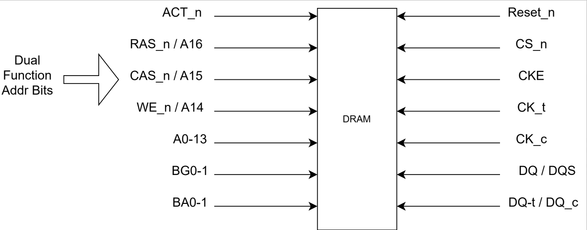

# DRAM - Basic Knowledge

Studied with [this](https://www.systemverilog.io/tags/#ddr4) webpage.

### Basic IO


- Dual Function Address Bits
    - `RAS_n`: Row Address Strobe
    - `CAS_n`: Column Address Strobe
    - `WE_n`: Write Enable Strobe
    - During Activation (`ACT_n`=0). They are used as row addressing, `A0-16`
    - During R/W/Pre (`ACT_n`=1). They combinationally define what function is operating. At the same time, other address bits will determine the column selection
- Posedge of `CK_t` and negedge of `CK_c`: All address & control signals are sampled at crossing to have exact timing
- Posedge of `DQS_t` and negedge of `DQS_c`: also differential property as `CK`. Data is sampled at both edges, into `DQ` 
- `DQ`: Carry actual data bits. Same width as column width. `x4` means `DQ[3:0]`; `x8` means `DQ[7:0]`; `x16` means `DQ[15:0]`
- `CAS Latency`: latency from read to `DQ`. `CAS Write Latency` is for write

### Bankgroups and Banks

- cmd/addr: select address and commands
- local IO: communicate with sense amplifier
- global IO: connect `BG#` into `DQ`

### Single Storage Structure
- wordline: row; bitline: column
- Need to be refreshed: why it is called __Dynamic RAM__
- Structure:
    - Rank (each needs a Chip Select (CS))
        - Bank Groups (BG)
            - Banks
                - Row / Page
                    - single column
- Steps:
    1. Activate; row select
    2. R/W; column select
    3. Pre-charge: close the row
    4. RDA (Read Auto-Precharge) / WRA (Write Auto-Precharge): can combine 2 & 3
- Write / Read are __Burst Oriented__

### Total DRAM Capacity Calculation

- `Total_Capacity` = `num_row` * `num_col` * `width_col` * `num_BG` * `num_bank`
- `Page_size` = `num_col` * `width_col` = number of bits per row
```
Example: row=A0-16; column=A0-A9; Width_col: x4; BG=4; num_bank=4.
We can calculate: 
    Total_Capacity = 2^16 * 2^10 * 4 * 4 * 4 = 4 GB
    Page_Size = 2^10 * 4 = 4 KB
```

### DRAM Sub-system


- User Logic: seng logic address and R/W request
- Controller: parse the logic address to physical address, and issue commands (like basic IO above) to DDR PHY
- PHY: actual signal send to DRAM

## Initialization Procedure

Check JEDEC Standard Chapter 3.1 for State Diagram

### ZQ Calibration

This can be used to calibrate internal banks of 240 ohm resistor, connected to DQ# pins, with external reference resistor.

### Vref DQ Calibration
In DDR3, Vdd/2 is used to as a reference to determine if DQ is 1 or 0, which is called Center Tapped Termination (CTT), or Series-Stud Terminated Logic (SSTL).

In DDR4, there is a internal voltage reference (VrefDQ) which can be used to decide DQ 1 or 0. VrefDQ can be set using MR6. This need to be set by memory controller during Vref DQ Calibration phase during initialization.

### R/W Training

For ASIC/Processors, each DRAM has different distance, so the skew between clock and data for each DRAM and DIMM is also different. We need to have internal circuit traning themselves to meet the write and read latency requirement. There are some algos that can do this.

1. Write Leveling
2. Multi-Purpose Register (MPR) Pattern Write
3. Read Centering
4. Write Centering


## Standard Reference (JEDEC)
- 2.7 Pinout Description
- 2.8 Addressing Types Standard
- 3.# Functions
    - 3.1 Functional State Diagram
    - 3.3 Initialization Process
    - 3.5 Mode Register: set up different things
- 4.1 Commands

# DRAM Memory System Organization
Studied through reading _Memory systems : cache, DRAM, disk by Jacob, Ng, and Wang_. Reference to the book pls.


